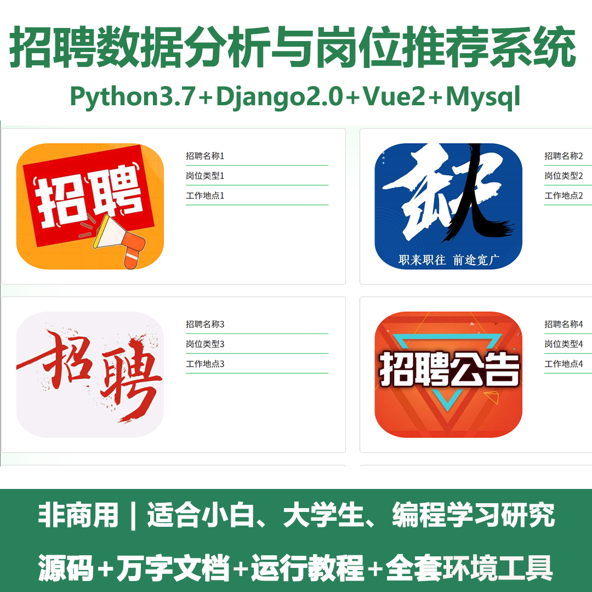
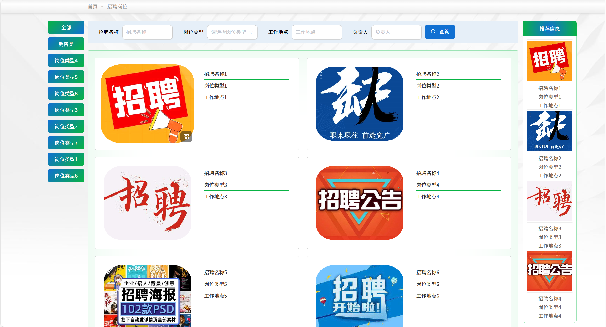
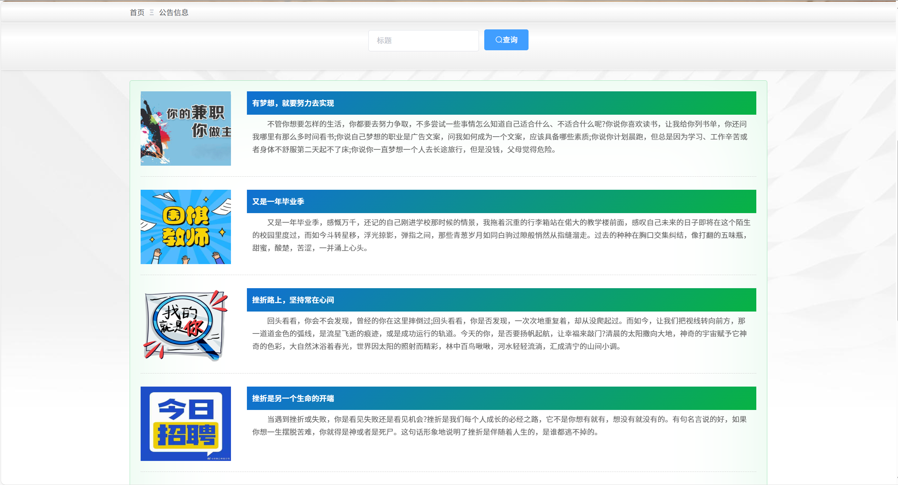
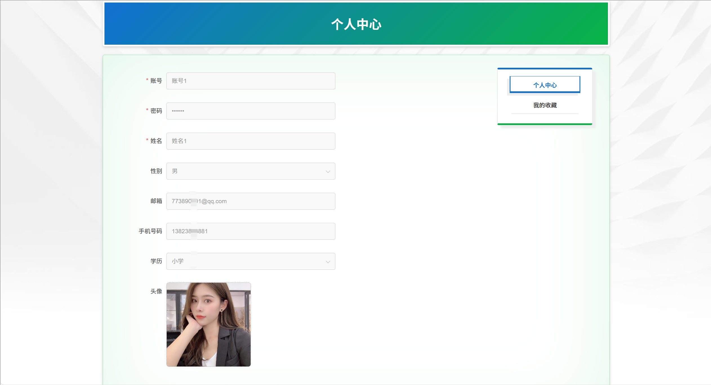
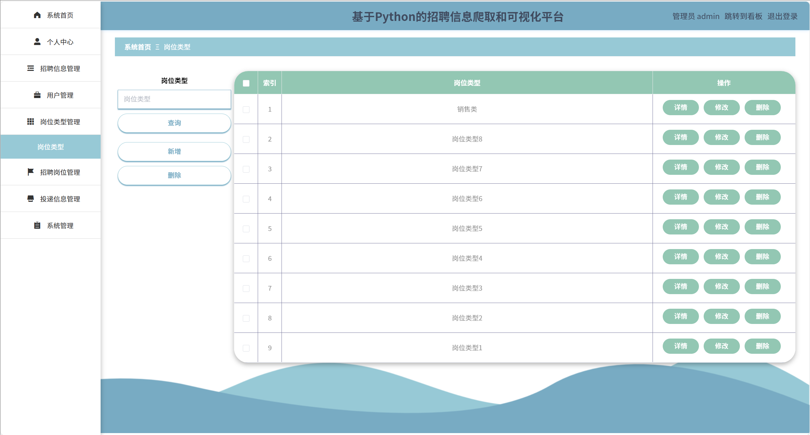
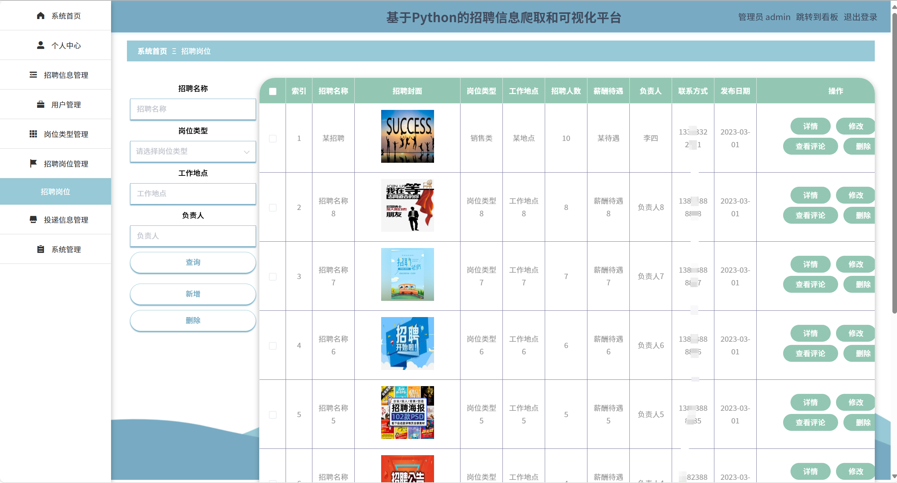
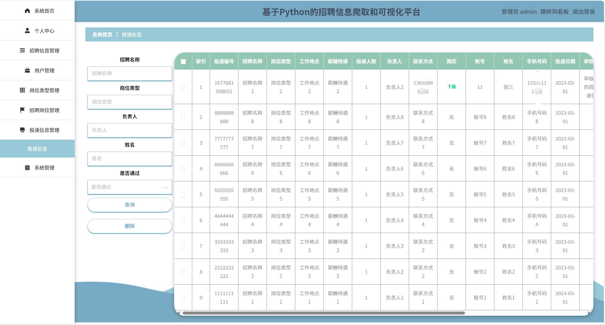
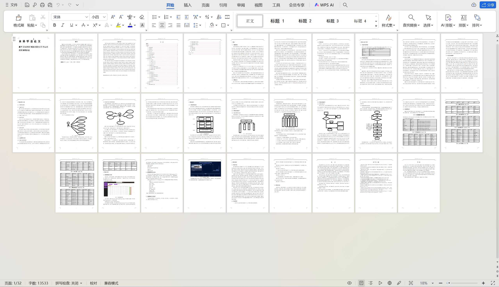

# python091
python091基于Python+Django的招聘数据分析与岗位推荐系统+LW
 
## 查看主页获取源码

### 一、关键词
招聘数据智能分析与岗位推送系统，人才招聘数据平台与岗位推荐系统，人才招聘数据分析与职位匹配系统

### 二、作品包含
源码+数据库+设计文档万字+全套环境和工具资源+本地部署教程

### 三、项目技术
前端技术：Vue2.0、Element-ui
后端技术：Python3.7、Django2.0

### 四、运行环境（以下版本亲测，其他版本兼容性请自行测试）
开发工具：PyCharm + VSCODE

数据库：MySQL5.7（最低要5.7版本）

数据库管理工具：Navicat10+

Python：Python3.7

前端Nodejs：14

浏览器：谷歌浏览器

### 五、项目介绍
项目编号：python091

基于DJANGO框架的面向IT行业的求职推荐系统，旨在实现用户对招聘数据的获取，并可以通过可视化平台对数据进行展现，提供系统内的信息检索手段，可以更有效的查询用户需要的招聘数据，最终实现了招聘数据的有效挖掘，提高了数据的准确率，实现了数据的统计查询功能，并对数据进行管理，提高了工作效率。

### 六、运行截图

